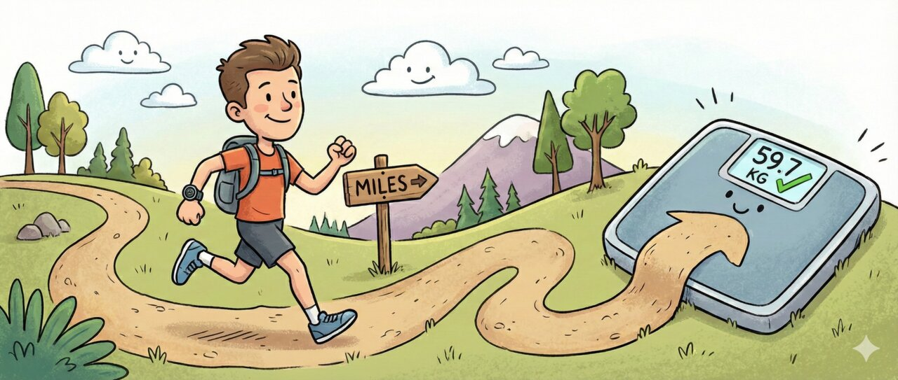

# Garmin Connect: Miles and Kilos

**A tiny Chrome extension for runners who think in miles but weigh in kilograms.**

## The Itch

You run in miles. Maybe you're in the US, the UK, or just prefer the cadence of "6-minute miles" over "3:43 per kilometer."

But you also weigh yourself in kilograms. Because that's what your scale shows. Or because you moved countries. Or because 75 sounds better than 165.

Garmin Connect gives you two choices:

| Setting | Distance   | Weight    |
| ------- | ---------- | --------- |
| Statute | Miles      | Pounds    |
| Metric  | Kilometers | Kilograms |

Pick one. Suffer.

**Until now.**

## The Fix

Keep Garmin Connect set to **Statute** (for miles). Install this extension. The extension converts weight from lbs to kg on the page—your mile splits stay untouched.

- **Zero config** - Install and forget
- **Body weight + exercise weights** - Converts lbs to kg everywhere
- **Works everywhere** - Charts, tables, popups, tooltips
- **Privacy-first** - Runs locally, sends nothing anywhere

## Install (1 minute)

Since this isn't in the Chrome Web Store:

1. **[Download ZIP](../../archive/refs/heads/master.zip)** and unzip it somewhere safe.
2. Copy-paste `chrome://extensions` into your address bar
3. Toggle **Developer mode** ON (top right corner)
4. Click **Load unpacked** (top left)
5. Select the unzipped folder
6. **Set Garmin Connect to Statute** - In Garmin Connect, go to Settings → Display Preferences → Measurement Units and select **Statute**. This keeps your distances in miles; the extension handles the weight conversion.
7. Visit [connect.garmin.com](https://connect.garmin.com) and check your weight page

## Permissions

Just one: access to `connect.garmin.com` to rewrite the text. Nothing else.

## Contributing

Contributions welcome! PRs and issues are appreciated. No guarantees on merging, but happy to look.

## Disclaimer

Not affiliated with Garmin. Just a runner who got tired of mental math.

## License

MIT - do whatever you want with it.
